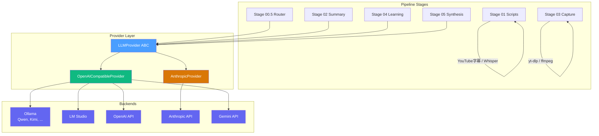

# pipeline-youtube-SDK

> **[pipeline-youtube](https://github.com/theosera/pipeline-youtube) のマルチ LLM SDK バージョン**

YouTube プレイリスト → Obsidian Vault 自学自習用学習レポート生成パイプライン。

元リポジトリの `claude -p` CLI サブプロセス依存を排除し、**Ollama / LM Studio / Anthropic / OpenAI / Gemini** の各 LLM バックエンドを直接 SDK 経由で呼び出す設計に変更。

## 元リポジトリとの主な違い

| 項目 | pipeline-youtube (CLI版) | pipeline-youtube-SDK |
|---|---|---|
| AI 呼び出し | `claude -p` subprocess (OAuth) | SDK 直接呼び出し (API キー / ローカル) |
| 認証 | `claude login` (OAuth セッション) | API キー or ローカル (認証不要) |
| 対応 LLM | Claude のみ | Ollama, LM Studio, Anthropic, OpenAI, Gemini |
| ステージ別モデル | モデル名のみ切替 | プロバイダー + モデルを個別指定可 |
| CI/サーバー実行 | 不可 (OAuth 依存) | 可能 (API キー設定のみ) |
| コスト | Claude Pro/Max 定額 | ローカル LLM: 無料 / クラウド API: 従量課金 |

## アーキテクチャ



> **ポイント**: Ollama / LM Studio / OpenAI / Gemini はすべて OpenAI 互換 API (`/v1/chat/completions`) を提供するため、`OpenAICompatibleProvider` 一つで統一的に扱えます。Anthropic のみ独自 API のため専用プロバイダーを使用します。

## セットアップ

```bash
# 前提: Python 3.13, uv, yt-dlp, ffmpeg が PATH にあること
cd pipeline-youtube-SDK
uv sync

# 編集可能インストール
uv pip install -e .

# 設定ファイルを作成
cp config.example.json config.json
# config.json で vault_root と providers/models を設定
```

### Ollama を使う場合 (推奨: 無料)

```bash
# Ollama をインストール: https://ollama.com
# モデルをダウンロード
ollama pull qwen3:8b

# config.json はデフォルトで Ollama を使用するので、
# vault_root を設定するだけで動作します
```

### Anthropic API を使う場合

```bash
export ANTHROPIC_API_KEY=sk-ant-api03-xxxxx

# config.json の models セクションを変更:
# "stage_02": {"provider": "anthropic", "model": "sonnet"}
```

### LM Studio を使う場合

```bash
# LM Studio を起動し、モデルをロード
# デフォルトで http://localhost:1234/v1 でサーバーが起動

# config.json:
# "models": {"stage_02": {"provider": "lmstudio", "model": "loaded-model-name"}}
```

## config.json の構成

```json
{
  "vault_root": "/path/to/your/Obsidian Vault",
  "providers": {
    "ollama":    {"base_url": "http://localhost:11434/v1"},
    "lmstudio":  {"base_url": "http://localhost:1234/v1"},
    "anthropic": {"api_key": "${ANTHROPIC_API_KEY}"},
    "openai":    {"api_key": "${OPENAI_API_KEY}"},
    "gemini":    {"base_url": "https://generativelanguage.googleapis.com/v1beta/openai",
                  "api_key": "${GEMINI_API_KEY}"}
  },
  "models": {
    "router":   {"provider": "ollama", "model": "qwen3:8b"},
    "stage_02": {"provider": "ollama", "model": "qwen3:8b"},
    "stage_04": {"provider": "anthropic", "model": "sonnet"},
    "alpha":    {"provider": "ollama", "model": "qwen3:8b"},
    "beta":     {"provider": "ollama", "model": "qwen3:8b"},
    "leader":   {"provider": "anthropic", "model": "sonnet"},
    "reviewer": {"provider": "anthropic", "model": "haiku"}
  }
}
```

> **混合構成の例**: Router は Ollama のローカルモデル (高速・無料)、Leader は Anthropic Claude (高品質) のように、ステージごとに異なるプロバイダーを使い分けられます。

## 使い方

```bash
# 通常実行: プレイリスト全体を 01〜05 まで処理
uv run python -m pipeline_youtube.main "https://www.youtube.com/playlist?list=PLxxx"

# dry-run (Vault 書き込みなし)
uv run python -m pipeline_youtube.main "URL" --dry-run

# Stage 05 をスキップ
uv run python -m pipeline_youtube.main "URL" --skip-synthesis

# Stage 05 だけ再実行
uv run python -m pipeline_youtube.main "URL" --synthesis-only

# 単一動画
uv run python -m pipeline_youtube.main "https://www.youtube.com/watch?v=VIDEO_ID"
```

CLI オプションは元リポジトリと同一です。詳細は [docs/cli.md](docs/cli.md) を参照。

## パイプライン概要

1. **Stage 00.5 Router**: プレイリストのジャンル分類 (coding/humanities/business/...)
2. **Stage 01 Scripts**: タイムスタンプ付き文字起こし (YouTube字幕 → 自動生成 → Whisper フォールバック)
3. **Stage 02 Summary**: 意味単位タイムスタンプ範囲付き要約
4. **Stage 03 Capture**: 要点タイムスタンプの動画フレーム抽出 (WebP アニメーション)
5. **Stage 04 Learning**: 上記を「時系列→キャプチャ→要点」3点セットでテーマ単位に再構成
6. **Stage 05 Synthesis**: Agent Teams (α→β→Leader) で全動画を横断統合

## 権利・利用上の注意

元リポジトリと同様、動画由来の生成物は **利用者自身のローカル環境における個人学習目的** でのみ扱うことを想定しています。詳細は元リポジトリの [README](https://github.com/theosera/pipeline-youtube#%E6%A8%A9%E5%88%A9%E5%88%A9%E7%94%A8%E4%B8%8A%E3%81%AE%E6%B3%A8%E6%84%8F) を参照してください。

## ライセンス

本リポジトリのコードは AS-IS で提供されます。
