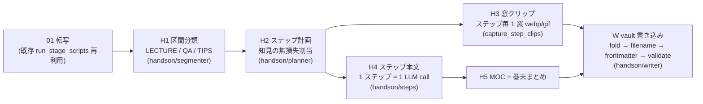

# ハンズオンモード (`--handson`)

1 本の**長編講演動画** (スライド提示が前提のトーク) から、ステップ分割された
ハンズオン教材 (手順ノート + MOC) を生成する専用モード。通常のプレイリスト
パイプライン (Stage 01〜05) を丸ごと置き換える独立経路で、判別ロジックは
`pipeline_youtube/handson/` パッケージとして独立実装されている。

## 何をするか

講演の合間に挟まる **Q&A セッション**には、講演者の試行錯誤・失敗談・構想の
経緯といった講演テーマの核が詰まっている。またQ&A 以外の合間に **Tips (小ネタ
・余談)** が語られることもある。本モードは文字起こしだけからこれらを判別し、
ハンズオンの関連ステップへ織り込み、さらに巻末まとめへ全件を集約する。



- **区間分類 (H1)**: タイムスタンプ付き転写 (30 秒チャンク) + 動画宣言チャプター
  (ヒント) を 1 回の LLM call で `lecture / qa / tips` に連続分割。境界スナップ・
  重複/隙間修復・全編被覆は **決定論の後処理** (`normalize_segments`) が保証する。
  分類が完全に失敗しても全編 LECTURE として続行する (安全側デフォルト)。
- **無損失の知見割当 (H2)**: QA/TIPS 区間は `q001…` / `p001…` の id で追跡され、
  「全 id はステップ割当 or 未割当リストのどちらかへ必ず配置」という契約を
  Python 側の被覆検査で強制。欠落は 1 回だけ再指示し、それでも残れば自動で
  未割当へ (= 巻末まとめに必ず載る)。
- **長編対応**: 既存パイプラインの `[MM:SS ~ MM:SS]` 正規表現は 99:59 が上限
  だが、本モードは **LLM と整数秒でやり取りし表示のみ H:MM:SS** に統一して
  いるため、2 時間 30 分 (`2:30:00`) を超える動画でも壊れない。
- **窓クリップ (H3)**: 既存 Stage 03 の抽出機構 (webp/gif、`--capture-format` /
  `--capture-backend` がそのまま有効) を `capture_step_clips()` seam 経由で再利用し、
  各ステップ範囲の中央に短い動画窓を 1 つ切り出してステップノートへ埋め込む。
  ダウンロード・抽出の失敗は該当ステップの埋め込みが無くなるだけで run は続行。

## 使い方

```bash
# 初回: 専用 config を作成 (品質重視のモデル設定を独立管理)
cp config.handson.example.json config.handson.json   # vault_root を設定

# 実行 (単一動画 URL 必須。playlist URL は UsageError)
uv run python -m pipeline_youtube.main "https://www.youtube.com/watch?v=<VIDEO_ID>" --handson

# 経路確認のみ (書き込みなし)
uv run python -m pipeline_youtube.main "https://www.youtube.com/watch?v=<VIDEO_ID>" --handson --dry-run
```

## 専用 config (`config.handson.json`)

長編 1 本は品質重視で回したい、という要件のため **`config.json` とは別名の
専用ファイル**を既定で読む (`--config` 明示時はそちらが優先)。スキーマ・ローダは
config.json と完全に同一で、モデル role キーだけ handson 用が増えている:

| role | 担当 | example の既定 |
|---|---|---|
| `handson_segment` | H1 区間分類 | sonnet |
| `handson_plan` | H2 ステップ計画 | sonnet |
| `handson_step` | H4 ステップ本文 (重い生成) | opus |
| `handson_moc` | H5 MOC + 巻末まとめ (重い生成) | opus |

`--hybrid` 使用時、`handson_step` / `handson_moc` は heavy stage として Anthropic に
固定される。LLM キャッシュは segment/plan が Stage 02/04 と同じ「決定論変換」枠
(既定 on)、step/moc が synthesis と同じ opt-in 枠 (`--cache-llm-synthesis`)。

## 出力レイアウト

`Permanent Note/09_YouTube学習_Session_only` 配下 (08 と同一のユニット構造):

```
Permanent Note/09_YouTube学習_Session_only/
├── 01_Scripts_Processing_Unit/{YYYY-MM-DD-HHmm 動画タイトル}/
│   └── {YYYY-MM-DD-HHmm 動画タイトル}.md      ← Stage 01 転写ノート
└── 05_Synthesis/{YYYY-MM-DD-HHmm 動画タイトル}/
    ├── 00_MOC.md                              ← ステップ構成・進め方・巻末への導線
    ├── 01_<ステップ名>.md … NN_<ステップ名>.md ← ゴール/手順/つまずき + Q&A/Tips callout + 窓クリップ
    ├── 99_QA_Tipsまとめ.md                    ← 全知見を [H:MM:SS] 出典付きで列挙 (欠落は自動追記)
    └── _meta/handson_meta.json                ← 区間・知見・計画・capture の実行記録
```

- 02/04 ユニットはこのモードでは実行しないため作られない。03 ユニットノートも
  作らない (クリップはステップノートへ直接埋め込み。実体は
  `Permanent Note/_assets/2026/pipeline-youtube/{run フォルダ}/pyt_<video_id>_hNN.<ext>`)。
- 書き込み安全策は Stage 05 と同一順序: homoglyph fold → `chapter_filename`
  サニタイズ → frontmatter 許可キー → `validate_chapter_body` (幻覚埋め込み・
  active HTML・Templater 除去) → 自前クリップ埋め込みの決定論追記。

## 制約 (v1)

- 単一動画のみ (`watch?v=X&list=Y` のような playlist 展開 URL は fetch 後に reject)。
- `--local-media` 未対応 (排他)。`--sub-agents` / phase 系フラグとも排他。
- genre router (Stage 00.5) は流用のため 1 回走る (haiku 1 call。`code_bearing`
  判定を転写整形とステップ本文のコード抽出指示に使う)。
- 判別入力は文字起こしのみ (映像・スライド画像の解析はしない)。
