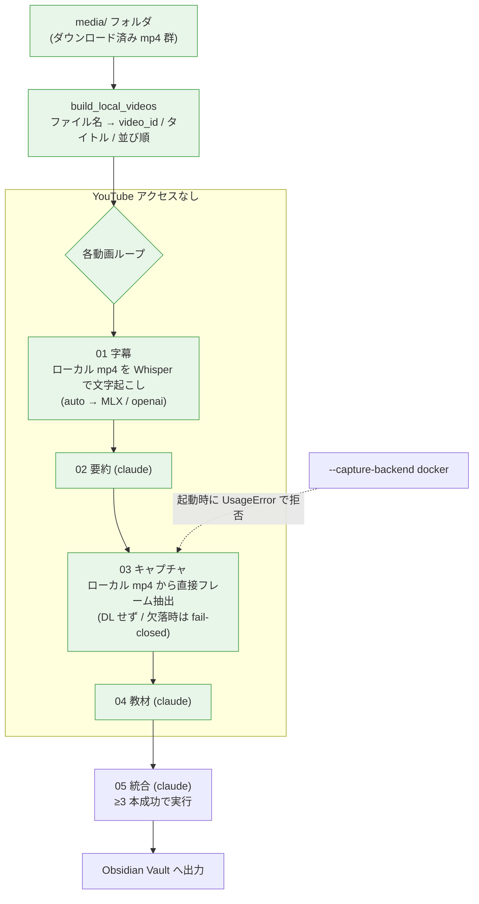

# 完全ローカル実行 (`--local-media`)

ダウンロード済みの **mp4 群が入ったフォルダ**からハンズオンを生成するモード。
**YouTube に一切アクセスしない**（メタデータ取得も字幕APIも動画DLも無し）。

`auto:ip_blocked`（YouTube の IP スロットリング）や `whisper:whisper_not_installed` の
"剥がれ"罠に左右されず、字幕の無い長尺動画でも確実に処理できる。LLM 工程（02/04/05）は
従来どおり `claude` を使う（＝"YouTube フリー"の意味で、claude は引き続き必要）。

## 使い方

```bash
# 1) プレイリストの動画をローカルに用意（video_id をファイル名に含める）
yt-dlp -o "%(playlist_index)s_%(title)s [%(id)s].%(ext)s" "<playlist-url>" -P ./media

# 2) フォルダを指して実行（Whisper を効かせるため --extra whisper 必須）
uv run --extra whisper python -m pipeline_youtube.main --local-media ./media

# サブエージェント並列も併用可（YouTube に触れないので throttling の心配なし）
uv run --extra whisper python -m pipeline_youtube.main --local-media ./media --sub-agents 3
```

URL は不要（付けても無視）。`zip` で固めたフォルダを展開して指すだけ。

## フロー図（完全オフライン）



- **緑**＝ YouTube に一切触れない範囲（メタデータ・字幕・動画 DL すべてローカル）。
- 03 はユーザーのローカル mp4 をそのまま使い、ファイルが無ければ**ダウンロードへフォールバックせず失敗**（`local_media_file_missing`）。
- `docker` capture backend はローカルメディアを参照できないため、`--local-media` との併用は**起動時に弾く**。

## ファイル名の規約

各ファイル名に **11 文字の YouTube video_id** を含めてください。`build_local_videos` が
2 形を認識します:

- `<id>.mp4`（yt-dlp `%(id)s.%(ext)s`）
- `Title [<id>].mp4`（yt-dlp `%(title)s [%(id)s].%(ext)s`）

id が無いファイルは**ファイル名から決定論的に合成した 11 文字 id** を付与（checkpoint が
扱える canonical 形式 `[A-Za-z0-9_-]{11}`）。ただしその場合 frontmatter の元動画リンクは
ダミーになる点に注意。

- **タイトル**: ファイル名から `[id]` を除いたもの（無ければ id）。
- **並び順**: ファイル名のソート順（`NN_` プレフィックスでプレイリスト順を保てる）。
- **プレイリスト名（出力フォルダ名）**: 指定フォルダの名前。
- **尺**: 取得しない（`None`）。表示が `0min` になるだけで処理に影響なし。

## 各ステージの挙動

| 工程 | 通常（URL） | `--local-media` |
|---|---|---|
| メタデータ | yt-dlp で取得 | フォルダ走査でローカル生成 |
| 01 字幕 | official→auto→Whisper(DL) | **ローカル mp4 を Whisper で文字起こし**（captions 不使用） |
| 03 キャプチャ | 動画をDLしてフレーム抽出 | **ローカル mp4 から直接抽出**（`prefetched_video_path` 流用） |
| 02 / 04 / 05 | claude | claude（変更なし） |

## 前提・注意

- **Whisper 必須**: 字幕はローカル Whisper のみ。**Apple Silicon は `uv run --extra mlx ...`
  （MLX/GPU・高速・低メモリ）推奨**、CPU 環境は `uv run --extra whisper ...`。バックエンド/
  モデルは `config.json` の `whisper_backend`/`whisper_model` で選択（[docs/whisper.md](whisper.md)）。
  素の `uv run` は extra を毎回剥がす点に注意。長尺は時間がかかる。
- **capture backend**: `host`（既定）のみ。`docker` はコンテナがメディアフォルダを
  マウントできないため `--local-media` と併用不可（起動時に `UsageError` で弾く）。
- `--synthesis-only` と併用すると、フォルダから動画一覧を作って既存 04 を読み 05 のみ再実行。
- 既知の限界: ファイル名に id が無い場合の合成 id は元動画 URL がダミーになる。
