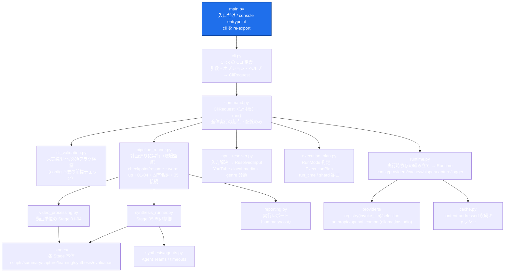

# main.py モジュール関係図（合成ルート中心 / SDK 版）

`main.py` を中心に、**直接 import・配線しているモジュール**と、その一段下の主要な関係だけに
絞った関係図。`main.py` リファクタを継続する際の地図として使う。

> ⚠️ **同期ルール（main.py と連動）**
> この図は `pipeline_youtube/main.py` → `cli.py` → `command.py` の **import /
> オーケストレーション配線**を反映したもの。
> **入口〜配線層（main / cli / command / cli_validation / runtime / input_resolver /
> execution_plan / pipeline_runner / synthesis_runner / reporting）の import・呼び出し・
> 段階の順序を変えたら、この図も同じ PR で更新すること。**
> `CLAUDE.md` の「Architecture invariant: main.py is a thin orchestrator」と対になる資料。
> 図が読みづらくなったら、それは入口層が太りはじめたサイン。

## 現構成（層A 抽出後）

`main.py` は **入口だけ**（`cli` を re-export する console entrypoint、~20 行）。
CLI 定義は `cli.py`、実行要求への変換と全体実行の起点は `command.py` に分離し、
各段階の HOW は専用モジュールへ出してある。SDK 版は claude CLI ではなくマルチ LLM
provider（`providers/registry`・`providers/selection`）と永続キャッシュ（`cache`）を
`runtime` で組み立てる点が非 SDK 版と異なる。

受け渡し用の DTO（`CliRequest` / `Runtime` / `ResolvedInput` / `ExecutionPlan` /
`RunMode`）は**葉モジュール `cli_types.py`** に集約する。各段モジュール
（runtime/input_resolver/execution_plan/pipeline_runner/synthesis_runner/cli_validation）は
**`cli_types` からのみ型を取り込み**、`command` への逆 import をしない
（= module-level cyclic import を作らない／CodeQL `py/unsafe-cyclic-import` を満たす）。



## 読み方（入口層の責務 = 配線のみ）

`command.run()` は次の一直線の配線だけを持つ（HOW は各モジュール側に閉じている）:

```text
validate_request(request)            # cli_validation: 未実装/排他/必須フラグ
runtime  = build_runtime(request)    # runtime:        道具を揃える（config/providers/cache/whisper/capture）
resolved = resolve_input(request, …) # input_resolver: 材料を揃える（動画リスト + genre）
plan     = build_plan(request, …)    # execution_plan: 作業計画書（RunMode/run_time/shard）
run_pipeline(request, runtime, …)    # pipeline_runner: 計画通りに実行 → 05 → レポート
```

| 段階 | 入口層がやること | HOW を持つモジュール（呼ぶだけ） |
|---|---|---|
| 受付 | オプション定義 → `CliRequest` 詰め替え | `cli.py` |
| 起点 | 検証→runtime→入力→計画→実行を**配線** | `command.py` |
| 検証 | 未実装(`--eval-loop`/`--folder-name`)・排他・必須フラグを弾く | `cli_validation` |
| 道具 | config 読込・provider 選択(`apply_selection`/`configure_providers`)・cache・whisper・capture・logger 初期化 | `runtime`（→ `cli_config` / `providers/registry` / `providers/selection` / `cache` / `whisper_fallback` / `sanitize` / `stages/capture_backend`） |
| 材料 | URL→メタデータ or local-media 走査 → genre 分類 | `input_resolver`（→ `playlist` / `local_media` / `genres`） |
| 計画 | RunMode と run_time/shard を確定 | `execution_plan`（→ `parallel` / `resume`） |
| 実行 | sub-agent 分散・shard 切出し・checkpoint/resume・transcript warm-up・01-04 起動・固有名詞シート更新・05 接続 | `pipeline_runner`（→ `video_processing` / `checkpoint` / `resume` / `proper_noun_sheet` / `parallel` / `stages/scripts`） |
| 統合 | Stage 05 入力準備・実行 | `synthesis_runner`（→ `stages/synthesis` / `synthesis/agents`） |
| 出力 | 動画サマリ・05 結果・コスト内訳の表示 | `reporting`（→ `run_result._print_cost_breakdown`） |

ポイント：矢印はすべて **入口層 → モジュール（呼び出し / 配線）** か
**モジュール → モジュール（HOW の内部関係）**。`main.py` / `cli.py` / `command.py` 自身に
ロジック・分岐・I/O は無い。

## 継続リファクタの指針

- 切替・モード・プロバイダ選択は入口層に `if/elif` を生やさず、`RunMode` などの値 +
  registry/strategy（`providers/registry` の `invoke_llm`、fetcher chain）で表現する。
- `pipeline_runner` のフェーズ（checkpoint / warm-up / 01-04 / 05 接続）が太ったら、その単位を
  さらに 1 モジュール（または stage）へ括り出せないか検討する。
- 次段（層B）の構想：`domain/`（純粋な型・契約）/ `services/`（cache・checkpoint・sanitize・
  path_safety の共通基盤）/ `agents/` / `schemas/` / `prompts/` への再パッケージング。
  差分が大きいので別 PR で段階的に。
